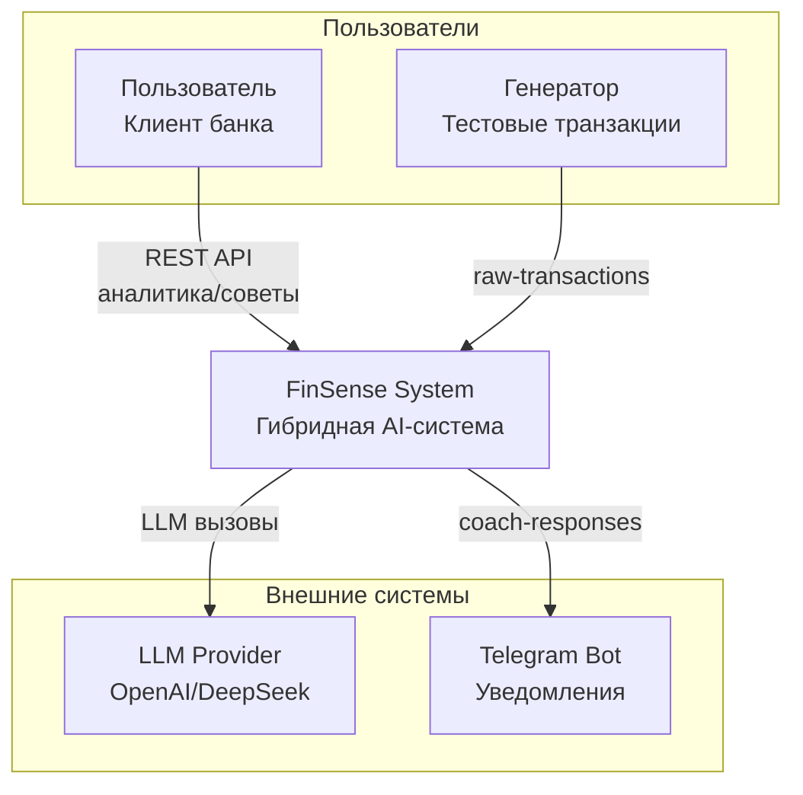
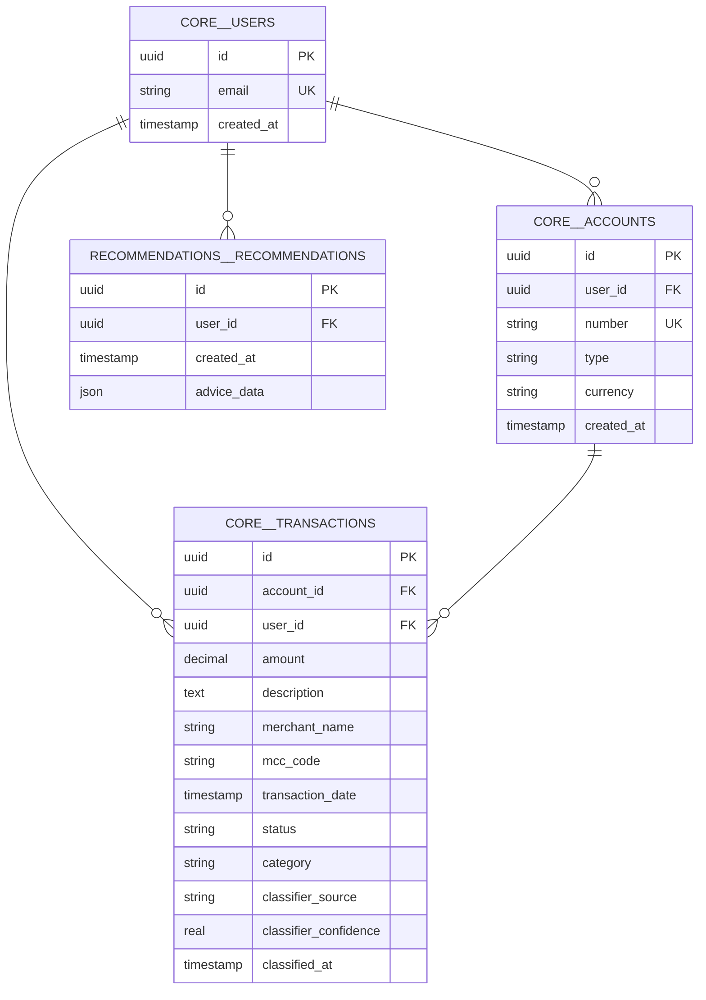
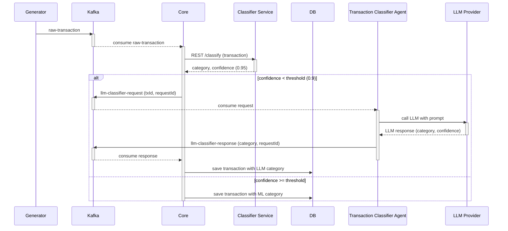
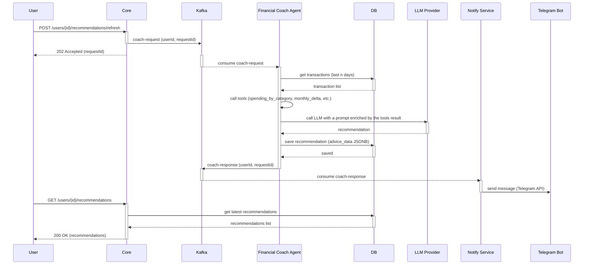
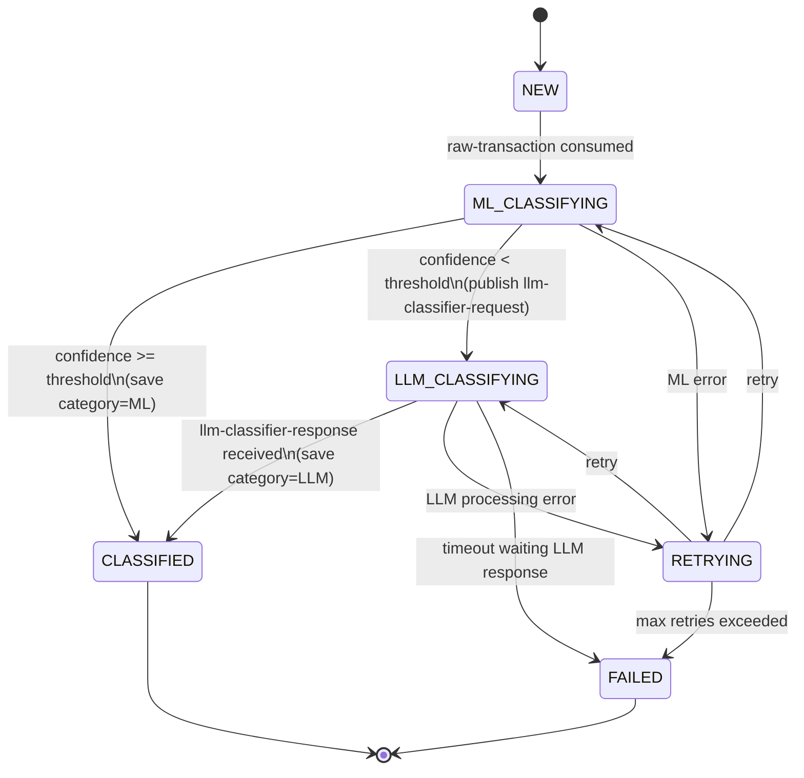
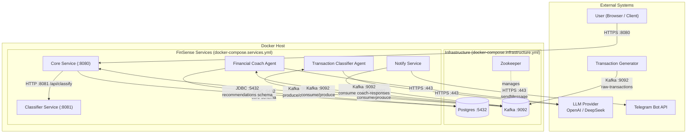

## System Context Diagram

## Logical Architecture

## DB Scheme

## Sequence diagrams

#### 1. Классификация транзакции (с гибридным подходом ML + LLM)

#### 2. Генерация рекомендации (по ручному запросу)

## State Diagram

## Deployment Diagram

