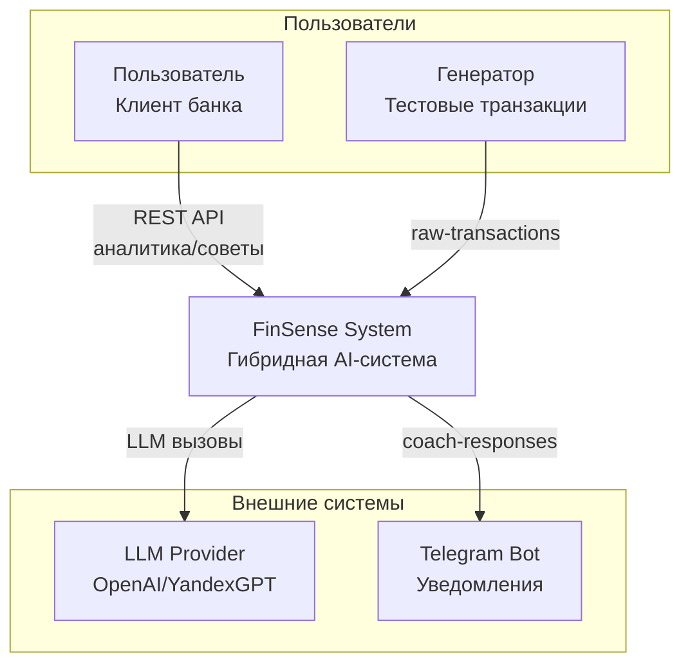
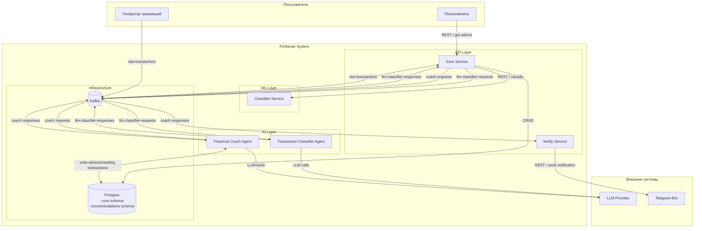
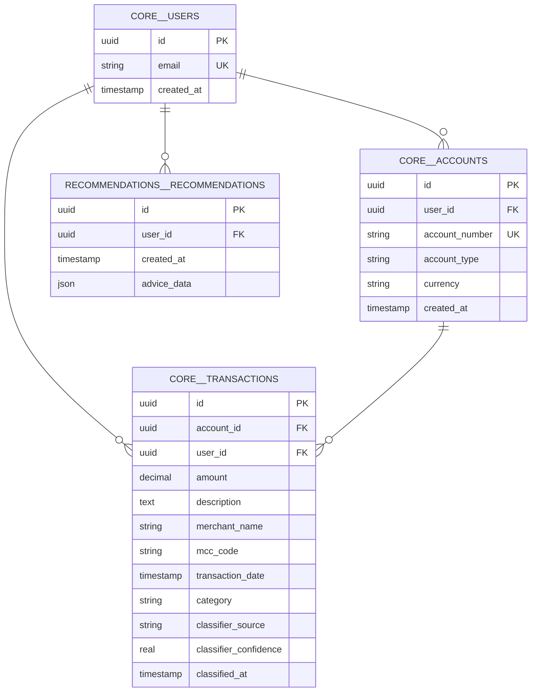

## System Context Diagram

## Kafka topics
- raw-transactions	Generator -> Core	Сырые транзакции
- llm-classifier-requests	Core ->	Reasoning Agent	Транзакции для LLM
- llm-classifier-responses	Reasoning Agent ->	Core	Результаты от LLM
- coach-requests	Core (scheduler + REST handler) -> Coach Agent	Запросы на генерацию советов (по расписанию или вручную)
- coach-responses	Coach -> Notify Service (опционально)	Готовые советы

## Logical Architecture

## DB scheme

