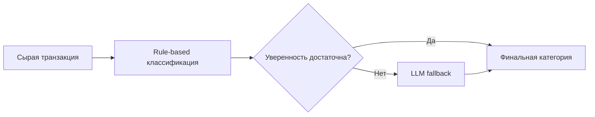
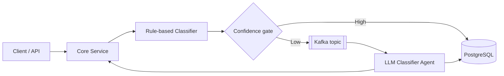
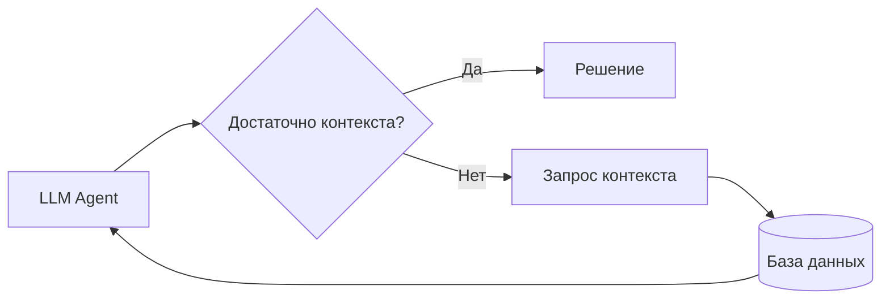

Ниже — **чистовой текст для вставки в PowerPoint**.
Я сразу добавил **таблицы** и **mermaid-схемы** там, где это усиливает слайд.

---

## Слайд 1:

**Разработка и внедрение AI-агента для оптимизации бизнес-процессов**
**Анализ существующих решений и разработка прототипа на базе Spring и Kotlin**

* Магистерская диссертация
* Направление подготовки: [вставить]
* Выполнил: [ФИО]
* Научный руководитель: [ФИО, степень, должность]
* [Университет], [год]

---

## Слайд 2:

**Актуальность и проблема исследования**

* Современные бизнес-процессы включают как формализуемые, так и неоднозначные операции
* Rule-based автоматизация эффективна в типовых сценариях, но плохо работает в сложных случаях
* Полный перенос принятия решений на LLM повышает гибкость, но увеличивает стоимость и задержки обработки
* Практически значимой является не автоматизация «ради AI», а улучшение измеримых параметров процесса
* Возникает задача построения подхода, сочетающего управляемость, адаптивность и инженерную реализуемость

| Подход     | Управляемость     | Гибкость          | Стоимость |
| ---------- | ----------------- | ----------------- | --------- |
| Rule-based | высокая           | низкая            | низкая    |
| Hybrid     | средняя / высокая | средняя / высокая | умеренная |
| Full LLM   | низкая / средняя  | высокая           | высокая   |

---

## Слайд 3:

**Объект, предмет, цель, задачи и методы исследования**

**Объект исследования**

* бизнес-процессы, включающие задачи классификации и принятия решения в условиях частичной неопределённости

**Предмет исследования**

* архитектурные и программные подходы к интеграции LLM-ориентированного AI-агента в событийно-ориентированный бизнес-процесс

**Цель исследования**

* разработать и исследовать прототип AI-агента, встроенного в событийно-ориентированный бизнес-процесс, и оценить применимость гибридного подхода: rule-based логика + LLM fallback

**Задачи**

* проанализировать существующие подходы к AI-автоматизации
* уточнить понятие AI-агента в контексте backend-системы
* разработать архитектуру прототипа
* реализовать прототип на Spring + Kotlin
* провести демонстрационную экспериментальную оценку

**Методы**

* сравнительный анализ
* архитектурное проектирование
* прототипирование
* сценарное моделирование
* экспериментальная оценка

---

## Слайд 4:

**AI-агент в контексте работы**

* В данной работе AI-агент рассматривается как программный компонент, встроенный в бизнес-процесс и принимающий решение в пределах заданной предметной области
* Агент получает входное событие, использует контекст обработки и возвращает результат в машиночитаемой форме
* В отличие от чат-бота, агент не ограничивается диалоговым ответом, а участвует в исполнении процесса
* В отличие от rule-based автоматизации, агент применяется для обработки случаев, не полностью покрываемых жёсткими правилами
* В отличие от полного перевода процесса на LLM, агент используется выборочно и встроен в архитектурные ограничения процесса

| Подход             | Основная функция                 | Ограничение                        | Роль в работе                |
| ------------------ | -------------------------------- | ---------------------------------- | ---------------------------- |
| Rule-based система | обработка типовых случаев        | плохо работает при неоднозначности | baseline                     |
| Чат-бот            | диалог с пользователем           | не управляет процессом             | не основной сценарий         |
| AI-агент           | принятие решения внутри процесса | требует архитектурного контроля    | основной объект исследования |

---

## Слайд 5:

**Анализ существующих подходов к AI-автоматизации**

* Rule-based автоматизация обеспечивает высокую скорость и предсказуемость, но ограничена заранее описанными сценариями
* ML-подходы расширяют покрытие сложных случаев, но требуют обучающих данных и отдельного цикла поддержки моделей
* LLM-решения позволяют обрабатывать неструктурированные и неоднозначные входные данные, но повышают стоимость и латентность
* Агентные подходы позволяют встроить LLM в прикладной процесс, сохраняя управляющую роль backend-архитектуры
* Для практического внедрения наиболее целесообразен гибридный подход, в котором быстрый путь обработки сохраняется, а LLM используется для ограниченного сегмента сложных случаев

| Подход                  | Сильная сторона                     | Ограничение             | Применимость в работе               |
| ----------------------- | ----------------------------------- | ----------------------- | ----------------------------------- |
| Rule-based              | высокая скорость, простота контроля | низкая адаптивность     | базовый слой                        |
| ML                      | покрытие сложных случаев            | нужны данные и обучение | не используется в текущем прототипе |
| LLM                     | гибкая интерпретация контекста      | стоимость и латентность | fallback                            |
| Agent-based integration | комбинирование AI и backend-логики  | сложнее архитектурно    | основа прототипа                    |

---

## Слайд 6:

**Обоснование выбора технологического стека**

* Прототип ориентирован не на изолированный эксперимент, а на реализацию в логике enterprise-backend
* Spring Boot используется как базовая платформа построения сервисной архитектуры
* Spring AI обеспечивает интеграцию с LLM через ChatClient
* Для доступа к модели используется DeepSeek API
* Kafka используется для асинхронной передачи событий и изоляции длительных LLM-вызовов от основного потока обработки
* Kotlin выбран благодаря краткости, типобезопасности и совместимости с Java-экосистемой
* PostgreSQL используется для хранения транзакций, результатов классификации и служебных данных

| Компонент    | Назначение в прототипе        |
| ------------ | ----------------------------- |
| Spring Boot  | базовая сервисная архитектура |
| Spring AI    | интеграция с LLM              |
| DeepSeek API | внешний LLM-провайдер         |
| Kafka        | событийное взаимодействие     |
| Kotlin       | язык реализации               |
| PostgreSQL   | хранение данных               |

---

## Слайд 7:

**Кейс исследования: классификация финансовых транзакций**

* В качестве прикладного кейса выбран процесс классификации финансовых транзакций
* Данный процесс является показательным, поскольку сочетает требования к скорости, точности и воспроизводимости обработки
* Для типовых транзакций используется быстрый rule-based слой
* Для неоднозначных и низкоуверенных случаев применяется LLM fallback
* Такой сценарий позволяет исследовать, как AI-компонент может дополнять, а не заменять существующую логику процесса

---

## Слайд 8:

**Архитектура прототипа**

* Core Service выполняет оркестрацию процесса, обработку REST-запросов и координацию компонентов
* Rule-based Classifier реализует быстрый базовый путь обработки типовых транзакций
* LLM Classifier Agent обрабатывает только low-confidence случаи и формирует уточнённый результат
* Kafka topics используются для асинхронной передачи событий между компонентами
* PostgreSQL хранит входные транзакции, результаты классификации и дополнительные атрибуты обработки
* Архитектура изолирует LLM-компонент от быстрого пути обработки и позволяет масштабировать AI-обработку отдельно

---

## Слайд 9:

**Основной сценарий: Transaction Classifier Agent**

* На вход поступает сырая транзакция
* Rule-based слой формирует первичную категорию и значение confidence
* При достаточной уверенности результат принимается без обращения к LLM
* При низкой уверенности запрос передаётся в LLM Classifier Agent
* Агент использует описание транзакции и доступный контекст для уточнения категории
* Итоговый результат возвращается в Core Service и сохраняется в системе

**Что оптимизируется**

* снижение доли неопределённых транзакций
* сокращение объёма ручной проверки
* сохранение быстрого основного потока
* ограничение доли дорогих LLM-вызовов

| Этап | Быстрый путь             | Расширенный путь                  |
| ---- | ------------------------ | --------------------------------- |
| 1    | поступление транзакции   | поступление транзакции            |
| 2    | rule-based классификация | rule-based классификация          |
| 3    | высокая уверенность      | низкая уверенность                |
| 4    | сохранение результата    | обращение к LLM                   |
| 5    | завершение               | уточнение и сохранение результата |

---

## Слайд 10:

**Потенциал расширения: context-aware сценарий**

* В текущей версии основной агент работает без tools и использует только входные данные процесса
* Архитектура допускает дальнейшее расширение за счёт инструментального получения дополнительного контекста
* Возможный вариант развития — ограниченный доступ агента к базе данных для получения дополнительной информации по транзакции или истории операций
* Такой подход может быть полезен в случаях, когда данных входного события недостаточно для уверенной классификации
* Данное расширение рассматривается как перспектива развития, а не как реализованная часть текущего прототипа

---

## Слайд 11:

**Методика экспериментальной оценки**

* Оценка проводится на синтетическом сценарном наборе транзакций
* Сравниваются два режима обработки:

  * baseline: только rule-based классификация
  * hybrid: rule-based классификация + LLM fallback для low-confidence случаев
* Качественные метрики:

  * accuracy
  * доля UNDEFINED
  * доля ручной проверки
* Операционные метрики:

  * p95 latency
  * throughput
  * error rate
* Экономические метрики:

  * стоимость LLM-вызовов
  * стоимость обработки потока транзакций
* Результаты интерпретируются как демонстрационные и не приравниваются к production-метрикам

| Группа метрик      | Метрики                                 |
| ------------------ | --------------------------------------- |
| Качество           | accuracy, доля UNDEFINED, manual review |
| Производительность | p95 latency, throughput, error rate     |
| Экономика          | cost per request, cost per flow         |

---

## Слайд 12:

**Предварительная демонстрационная оценка**

* В baseline-сценарии rule-based слой обеспечивает высокую скорость, но оставляет часть транзакций в состоянии неопределённости
* В hybrid-сценарии ожидается рост точности классификации за счёт обработки low-confidence сегмента через LLM
* Демонстрационно можно рассматривать следующие ориентиры:

  * accuracy: **84–87% → 91–94%**
  * доля UNDEFINED: **7–10% → 2–4%**
  * доля ручной проверки: **5–8% → 1–3%**
* При этом доля LLM-вызовов должна оставаться ограниченной, например **5–12%** от общего потока
* Такие значения трактуются как модельная оценка на синтетическом наборе, а не как подтверждённый промышленный результат

| Метрика          | Baseline | Hybrid |
| ---------------- | -------: | -----: |
| Accuracy         |   84–87% | 91–94% |
| Доля UNDEFINED   |    7–10% |   2–4% |
| Ручная проверка  |     5–8% |   1–3% |
| Доля LLM-вызовов |       0% |  5–12% |

---

## Слайд 13:

**Научная новизна, практическая значимость и выводы**

**Научная новизна**

* уточнено понимание AI-агента как управляемого компонента событийно-ориентированного backend-процесса
* предложен архитектурный подход к гибридной обработке, сочетающий rule-based логику и LLM fallback
* показан способ интеграции LLM-компонента в Spring/Kotlin-стек без перевода всего процесса на AI-обработку

**Практическая значимость**

* разработан прототип, демонстрирующий воспроизводимый паттерн внедрения LLM в прикладной backend-процесс
* предложен набор метрик для оценки качества, латентности и стоимости AI-компонента
* показана применимость event-driven подхода для изоляции длительных LLM-вызовов от быстрого пути обработки

**Выводы**

* Наибольшую практическую ценность представляет не полный перевод процесса на LLM, а управляемое включение AI в ограниченный сегмент сложных случаев
* Гибридный подход позволяет сочетать скорость rule-based обработки и гибкость LLM
* Разработанный прототип подтверждает инженерную реализуемость и исследовательскую перспективность данного подхода

| Блок                    | Основной результат                                           |
| ----------------------- | ------------------------------------------------------------ |
| Новизна                 | архитектурный подход к LLM fallback внутри backend-процесса  |
| Практическая значимость | воспроизводимый паттерн интеграции                           |
| Итог                    | управляемый hybrid-подход предпочтительнее full-LLM-сценария |

---

## Слайд 14:

**Источники и технологическая база**

* работы по LLM-based agents и agentic AI
* документация Spring AI
* документация Spring Boot и Spring Kafka
* документация DeepSeek API
* документация Apache Kafka
* документация Kotlin
